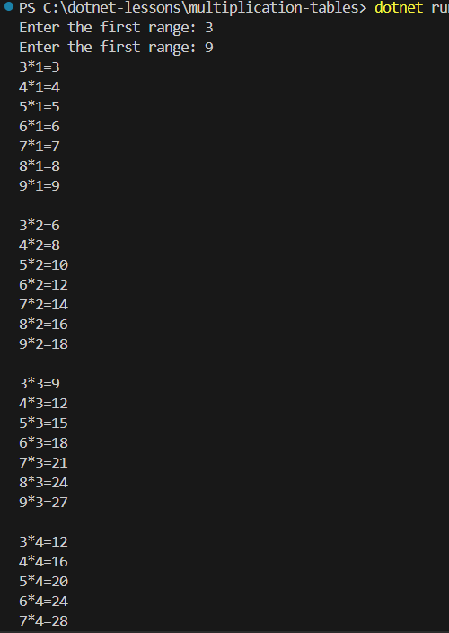

# Multiplication-tables

> #### Print out a multiplication table!
>
> - Enter the first range
> - Enter the second range.
>
> This is a  **[console app](https://learn.microsoft.com/en-us/visualstudio/get-started/csharp/tutorial-console?view=vs-2022)** with a range between two numbers.

---

### Example:

 

**Goog luck!**
